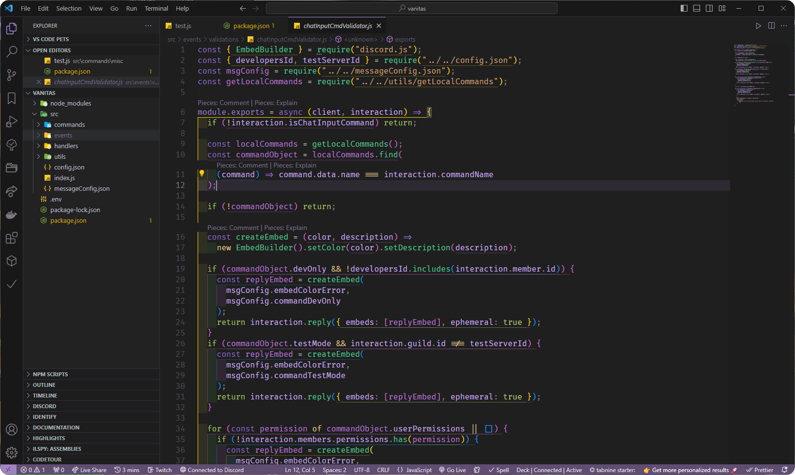
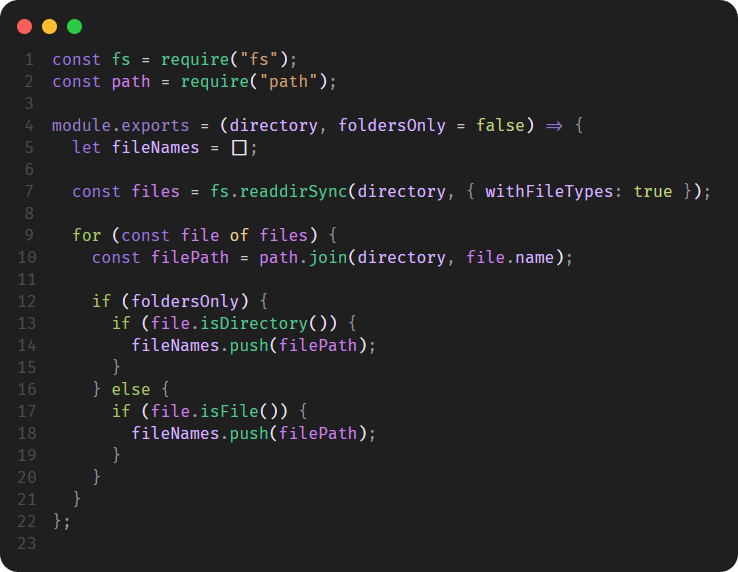
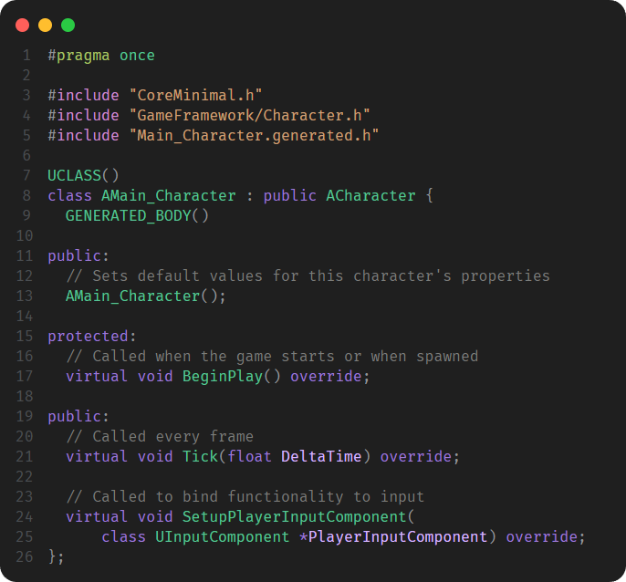
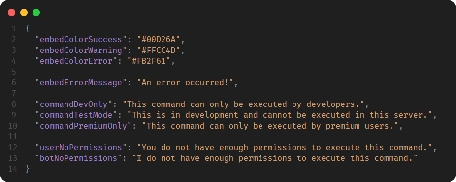

  

# DreamTheme
The ultimate theme for your vscode. Shades of purple that comfies the eyes and keep your views as aesthetically as possible. more suitable for the lovers of purple shades 💜

> [!WARNING]
> This theme is in BETA version, therefore colors and hues can be seem quite incomplete as well as for other languages.

## Installation

Just simply go to [DreamTheme on VS Marketplace](https://marketplace.visualstudio.com/items?itemName=Iconical.DreamTheme) and follow their installation guide and you should be good to go.

## Preview

  
 

   
  
 

  

